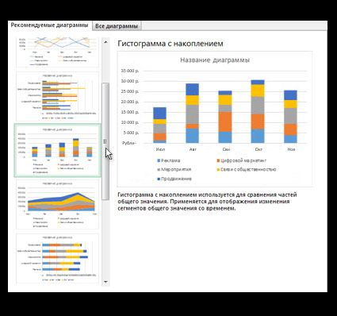

# Графики в Excel

## Начало работы с графиками 

Убедитесь, что Excel установлен на вашем ПК. Скачать последнюю версию программы для вашей операционной системы вы можете на [сайте центра загрузки Microsoft](https./media//www.microsoft.com/en-us/download/office). Также вы можете воспользоваться [веб-версией Excel](https://office.com/signin) в вашем браузере или [установить приложение на ваше мобильное устройство](https://www.microsoft.com/en-us/microsoft-365/excel/mobile-app)

Стоит отметить, что не все типы графиков доступны в Excel 2013 и более ранних версиях для Windows, в Office 2011 для MacOS и в веб-версии приложения.

## Создание графика

### Создание графика в Windows 

1. В открытой таблице выберите данные, которые вы хотите использовать для графика 

    
    
2. Во вкладке **Вставка** нажмите кнопку **Рекомендукемые диаграммы**

    
    
3. Во вкладке **Рекомендуемые диаграммы** просмотрите список диаграмм, рекомендуемых для ваших данных, и щелкните по нужной для предварительного просмотра

> Если ни одна из рекомендуемых диаграмм не подходит, то вы можете просмотреть все диаграммы во вкладке **Все диаграммы**

   

4. Выбрав диаграмму, нажмите кнопку **ОК**

5. С помощью кнопок **Элементы диаграммы**, **Стили диаграмм** и **Фильтры диаграммы** рядом с верхним правым углом диаграммы добавьте необходимые для вас элементы диаграммы: названия осей или подписи данных, настройте внешний вид диаграммы или измените данные, отображаемые в ней

   
   
6. Чтобы получить доступ к дополнительным возможностям проектирования и форматирования, щелкните по диаграмме, чтобы в ленте появилась вкладка **Работа с диаграммами** и выберите нужные параметры во вкладках **Конструктор** и **Формат**.

    

### Создание графика в MacOS

1. В открытой таблице выберите данные, которые вы хотите использовать для графика 

   
   
2. Во вкладке **Вставка** нажмите кнопку **Рекомендукемые диаграммы**

    

3. Во вкладке **Рекомендуемые диаграммы** просмотрите список диаграмм, рекомендуемых для ваших данных, и щелкните по нужной для предварительного просмотра

> Если ни одна из рекомендуемых диаграмм не подходит, то вы можете просмотреть все диаграммы во вкладке **Все диаграммы**

   

4. Выбрав диаграмму, нажмите кнопку **ОК**

5. С помощью кнопок **Элементы диаграммы**, **Стили диаграмм** и **Фильтры диаграммы** рядом с верхним правым углом диаграммы добавьте необходимые для вас элементы диаграммы: названия осей или подписи данных, настройте внешний вид диаграммы или измените данные, отображаемые в ней

    

6. Чтобы получить доступ к дополнительным возможностям проектирования и форматирования, щелкните по диаграмме, чтобы в ленте появилась вкладка **Работа с диаграммами** и выберите нужные параметры во вкладках **Конструктор** и **Формат**.

    

### Создание графика в веб-версии

1. В открытой таблице выберите данные, которые вы хотите использовать для графика.

2. Во вкладке **Вставка** нажмите кнопку **Рекомендуемые диаграммы**.

3. Выберите диаграмму для вставки в появившейся области задач **Рекомендуемые диаграммы** и выберите один из двух параметров: **+ Вставка сводной диаграммы** или **+ Вставка диаграммы**.
> Если выбран параметр **Вставка сводной диаграммы**, то Excel вставит новый лист со сводной таблицей - источником данных для сводной диаграммы. При каждом использовании параметра **Вставка сводной диаграммы** Excel будет вставлять новый лист. В противном случае, если выбран параметр **Вставка диаграммы**, Excel вставит диаграмму непосредственно на лист с исходными данными.

### Создание графика в Android

1. Откройте книгу и перейдите в электронную таблицу, содержащую данные.

2. Выберите данные, которые вы хотите использовать для графика, перетащив маркеры .

3. На планшете с Android нажмите **Вставка**.

    

Если у вас телефон с Android, коснитесь значка редактирования , нажмите **Главная**, а затем — **Вставка**.

4. Нажмите **Рекомендуемые диаграммы**, чтобы просмотреть список диаграмм, подобранных для ваших данных.

5. Коснитесь изображения рекомендуемой диаграммы, чтобы увидеть, как ваши данные будут выглядеть в таком формате.

> Советы: 
>
>    Если подходящего формата нет, нажмите **Диаграмма** на вкладке **Вставка**, чтобы просмотреть все доступные типы диаграмм.
>
   

6. При выборе макета диаграммы появляется вкладка **Диаграмма**.

    

    На этой вкладке можно просмотреть и выбрать тип диаграммы, макет с условными обозначениями, цветовую схему и элементы диаграммы. Кроме того, можно нажать кнопку **Переключить**, чтобы просмотреть другие форматы.

7. Коснитесь диаграммы, чтобы открыть контекстное меню.

    

    Вы можете вырезать и вставить диаграмму, скопировать или удалить ее. Кроме того, можно прикоснуться к диаграмме и перетащить ее в другое место на листе.

### Создание графика в iOS

1. Откройте книгу и перейдите в электронную таблицу, содержащую данные.

2. Выберите данные, которые вы хотите использовать для графика, перетащив маркеры .

3. На iPad нажмите **Вставка**.

    

Если у вас iPhone, коснитесь значка редактирования , нажмите **Главная**, а затем — **Вставка**.

4. Нажмите **Рекомендуемые диаграммы**, чтобы просмотреть список диаграмм, подобранных для ваших данных.

5. Коснитесь изображения рекомендуемой диаграммы, чтобы увидеть, как ваши данные будут выглядеть в таком формате.

> Советы: 
>
>    Если подходящего формата нет, нажмите **Диаграмма** на вкладке **Вставка**, чтобы просмотреть все доступные типы диаграмм.
>
   

6. При выборе макета диаграммы появляется вкладка **Диаграмма**.

    

    На этой вкладке можно просмотреть и выбрать тип диаграммы, макет с условными обозначениями, цветовую схему и элементы диаграммы. Кроме того, можно нажать кнопку **Переключить**, чтобы просмотреть другие форматы.

7. Коснитесь диаграммы, чтобы открыть контекстное меню.

    

    Вы можете вырезать и вставить диаграмму, скопировать или удалить ее. Кроме того, можно прикоснуться к диаграмме и перетащить ее в другое место на листе.

### Создание графика в Windows Mobile

1. Откройте книгу и перейдите в электронную таблицу, содержащую данные.

2. Выберите данные, которые вы хотите использовать для графика, перетащив маркеры .

3. На планшете с Windows Mobile нажмите **Вставка**.

    

Если у вас телефон с Windows Mobile, коснитесь значка редактирования , нажмите **Главная**, а затем — **Вставка**.

4. Нажмите **Рекомендуемые диаграммы**, чтобы просмотреть список диаграмм, подобранных для ваших данных.

5. Коснитесь изображения рекомендуемой диаграммы, чтобы увидеть, как ваши данные будут выглядеть в таком формате.

> Советы: 
>
>    Если подходящего формата нет, нажмите **Диаграмма** на вкладке **Вставка**, чтобы просмотреть все доступные типы диаграмм.
>
   

6. При выборе макета диаграммы появляется вкладка **Диаграмма**.

    

    На этой вкладке можно просмотреть и выбрать тип диаграммы, макет с условными обозначениями, цветовую схему и элементы диаграммы. Кроме того, можно нажать кнопку **Переключить**, чтобы просмотреть другие форматы.

7. Коснитесь диаграммы, чтобы открыть контекстное меню.

    

    Вы можете вырезать и вставить диаграмму, скопировать или удалить ее. Кроме того, можно прикоснуться к диаграмме и перетащить ее в другое место на листе.
